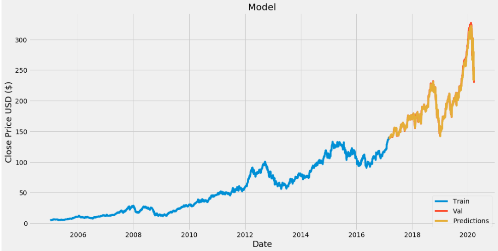

# Stockprice Prediction

Predicting how the stock market will perform is one of the most difficult things to do. There are so many factors involved in the prediction – physical factors vs. physhological, rational and irrational behaviour, etc. All these aspects combine to make share prices volatile and very difficult to predict with a high degree of accuracy.

The time-series modelling is an effctive strategy of prediction. For this purpose the project uses a LSTM (long-short term memory) network to predict the price.
The dataset is táken from Yahoo.

This is a first step of implementation and check towards the price prediction. The modelling can be on a later stage can be taken to higher level

Also a point to be noted the future prediction differs a lot with truth with varying data because of inconsistent economic trends and less sparse data used for experiment

An example of the prediction is shown in the images directory using a graph

